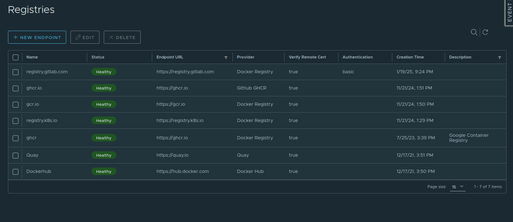
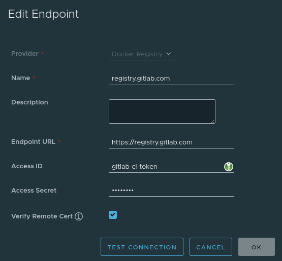
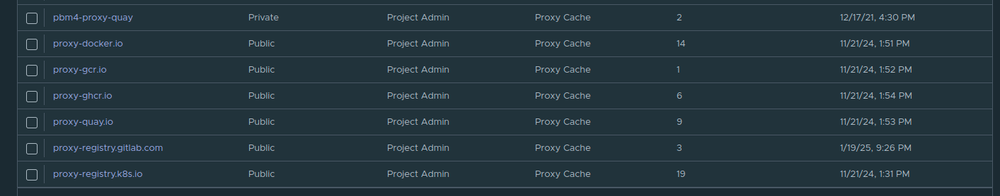

# Cluster API Machine Images

This repository contains configuration to build custom Hetzner Cloud images using the [kubernetes-sigs/image-builder](https://github.com/kubernetes-sigs/image-builder).
The primary goal is to create images compatible with Cluster API (CAPI) for node provisioning.

At the moment we create a machine image only for HCloud based on Ubuntu 24.04 with Kubernetes version 1.31.4.

## Configuration

We mostly use the defaults from [image-builder](https://image-builder.sigs.k8s.io/capi/capi#configuration).
In [config](config/) folder we have our configuration.

We defined a [packer-patch.json](./config/packer-patch.json) file,
which we use to patch the original [packer.json](https://github.com/kubernetes-sigs/image-builder/blob/main/images/capi/packer/hcloud/packer.json) file,
so that packer runs our scripts.

### Variables

We define which versions of k8s, CNI and containerd to install in [config/vars/k8s-1.31.json](config/vars/k8s-1.31.json).

### Additional Tools

We implement a script, which installs additional tools in machine images,
in [config/scripts/additional-tools.sh](./config/scripts/additional-tools.sh).

### Container Registry Mirrors

We implement a script to define proxy registries for Harbor in [config/scripts/cri.sh](./config/scripts/cri.sh).

#### How to configure proxy registries in Harbor?

First create registries in Harbor:



For GitLab registry, a repo-level access token
(`HARBOR_TOKEN` created in `container-images` repo with `Developer` role and `read_registry` scope) should be created:



Create projects in Harbor:

* Select `Public`
* Enable `Proxy Cache` and select corresponding registry



Run for example following command to test image pulling:
`docker pull "$CONTAINER_REGISTRY_URL/proxy-registry.k8s.io/kube-proxy@sha256:db28d4b5194a086fc60084fb1e338cc324ae0a7f537a476534cc7819d670715c"`

Ref: <https://www.talos.dev/v1.9/talos-guides/configuration/pull-through-cache/#using-harbor-as-a-caching-registry>

## Image Generation

### Actions

We have a [workflow](https://github.com/unbyte-de/cluster-api-machine-images/actions/workflows/hcloud-image-builder.yaml) to generate an image,
which has to be executed manually.
You just have to click on "Run workflow" and select the hetzner project and base OS.

#### New Project

When you have a new Hetzner project and want to generate an image for it, you have to

1. Generate a API token for that project
2. [Create a new environment](https://github.com/unbyte-de/cluster-api-machine-images/settings/environments/new) with the same name as the project
3. Define environment secrets `HCLOUD_TOKEN` and `CONTAINER_REGISTRY_URL` in the new environment

### Local

Here is commands to run locally which builds an image and pushes it into HCloud.
Image will be pushed to `Snapshots` of the project where generated API token belongs to.

We use the [official container image](https://image-builder.sigs.k8s.io/capi/container-image) to generate an image locally.

Variables:

* `HCLOUD_TOKEN`: Generate an hcloud API token at `https://console.hetzner.com/projects/<your-project-id>/security/tokens`.
* `HCLOUD_LOCATION`: This is the location where packer image builder server provisioned at.
* `OS_INFO`: Operating system to install.
  Possible OS are listed in [image-builder documentation](https://image-builder.sigs.k8s.io/capi/providers/hcloud#configuration).
* `PACKER_VAR_FILES`: Where to mount [custom packer var file](./config/vars/k8s-1.31.json).
* `CONTAINER_REGISTRY_URL`: Harbor registry URL for container image proxy.

```sh
export HCLOUD_TOKEN="generate-it"
export HCLOUD_LOCATION=fsn1
export OS_INFO="ubuntu-2404"
export PACKER_VAR_FILES=/tmp/k8s-1.31.json
export CONTAINER_REGISTRY_URL="https://harbor.devops1.pbm.sh"
export IMAGE_BUILDER=registry.k8s.io/scl-image-builder/cluster-node-image-builder-amd64:v0.1.48@sha256:4a522321b30c855efeeb6503f663046aca5c12f14edeb41ee7ef3ae617e3597a

docker run --rm \
  --env HCLOUD_LOCATION=${HCLOUD_LOCATION} \
  --env HCLOUD_TOKEN=${HCLOUD_TOKEN} \
  --env PACKER_VAR_FILES=${PACKER_VAR_FILES} \
  --env OS_INFO=${OS_INFO} \
  -v "${PWD}/config/scripts:/home/imagebuilder/packer/hcloud/scripts" \
  -v "${PWD}/config/packer-patch.json:/tmp/packer-patch.json" \
  -v "${PWD}/config/vars/k8s-1.31.json:${PACKER_VAR_FILES}" \
  --entrypoint /bin/sh \
  "${IMAGE_BUILDER}" \
  -c 'set -e
      echo "Patch..." &&
      jq --slurpfile patch /tmp/packer-patch.json \
        ".provisioners += \$patch[0].provisioners" \
        packer/hcloud/packer.json > /tmp/packer.json && \
      mv /tmp/packer.json packer/hcloud/packer.json && \
      export PACKER_FLAGS="-var container_registry_url='"${CONTAINER_REGISTRY_URL}"'" && \
      echo "Validate..." && /usr/bin/make "validate-hcloud-${OS_INFO}" && \
      echo "Build..." && /usr/bin/make "build-hcloud-${OS_INFO}"'
# This will run following command
# /home/imagebuilder/.local/bin/packer build \
#   -var-file="/home/imagebuilder/packer/config/kubernetes.json" \
#   -var-file="/home/imagebuilder/packer/config/cni.json" \
#   -var-file="/home/imagebuilder/packer/config/containerd.json" \
#   -var-file="/home/imagebuilder/packer/config/wasm-shims.json" \
#   -var-file="/home/imagebuilder/packer/config/ansible-args.json" \
#   -var-file="/home/imagebuilder/packer/config/goss-args.json" \
#   -var-file="/home/imagebuilder/packer/config/common.json" \
#   -var-file="/home/imagebuilder/packer/config/additional_components.json" \
#   -var-file="/home/imagebuilder/packer/config/ecr_credential_provider.json" \
#   -var container_registry_url=https://harbor.devops1.pbm.sh \
#   -color=true \
#   -var-file="packer/hcloud/hcloud-config.json" \
#   -var-file="/home/imagebuilder/packer/hcloud/ubuntu-2404.json" \
#   -var-file="/tmp/k8s-1.31.json" \
#   packer/hcloud/packer.json

```

## References

* <https://github.com/kubernetes-sigs/image-builder/tree/main/images/capi>
  * <https://github.com/unbyte-de/image-builder/tree/main/images/capi/packer/config>
  * <https://github.com/unbyte-de/image-builder/tree/main/images/capi/packer/hcloud>
* <https://image-builder.sigs.k8s.io/capi/providers/hcloud>
* <https://image-builder.sigs.k8s.io/capi/capi#customization>
